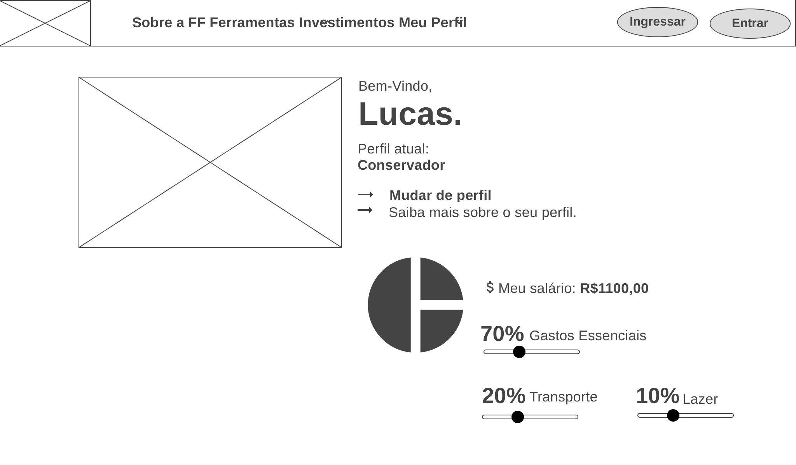

# Informações do Projeto
`TÍTULO DO PROJETO`  

Finance First!

`CURSO` 

Ciência da Computação

## Participantes
Alexandre Jurka

Eduardo Fonseca

Lucas Jesuíno

Lucas Jhony

Mateus Gonçalves

Pedro Henrique

Yan Sabarense

# Estrutura do Documento

- [Informações do Projeto](#informações-do-projeto)
  - [Participantes](#participantes)
- [Estrutura do Documento](#estrutura-do-documento)
- [Introdução](#introdução)
  - [Problema](#problema)
  - [Objetivos](#objetivos)
  - [Justificativa](#justificativa)
  - [Público-Alvo](#público-alvo)
- [Especificações do Projeto](#especificações-do-projeto)
  - [Personas e Mapas de Empatia](#personas-e-mapas-de-empatia)
  - [Histórias de Usuários](#histórias-de-usuários)
  - [Requisitos](#requisitos)
    - [Requisitos Funcionais](#requisitos-funcionais)
    - [Requisitos não Funcionais](#requisitos-não-funcionais)
  - [Restrições](#restrições)
- [Projeto de Interface](#projeto-de-interface)
  - [User Flow](#user-flow)
  - [Wireframes](#wireframes)
- [Metodologia](#metodologia)
  - [Divisão de Papéis](#divisão-de-papéis)
  - [Ferramentas](#ferramentas)
  - [Controle de Versão](#controle-de-versão)
- [**############## SPRINT 1 ACABA AQUI #############**](#-sprint-1-acaba-aqui-)
- [Projeto da Solução](#projeto-da-solução)
  - [Tecnologias Utilizadas](#tecnologias-utilizadas)
  - [Arquitetura da solução](#arquitetura-da-solução)
- [Avaliação da Aplicação](#avaliação-da-aplicação)
  - [Plano de Testes](#plano-de-testes)
  - [Ferramentas de Testes (Opcional)](#ferramentas-de-testes-opcional)
  - [Registros de Testes](#registros-de-testes)
- [Referências](#referências)

# Introdução 
>Problemas financeiros afetam grande parcela da população, visto que compõe uma parte significativa de nossas vidas. Por isso, é essencial sabermos gerenciar os nossos recursos financeiros e termos uma relação saudável com o dinheiro para conservar a saúde mental. 
>De acordo com os resultados de um estudo, apenas uma parcela de 33% da população mundial domina três dos quatro conceitos abordados na pesquisa e pode ser considerada educada financeiramente. Isso significa que duas a cada três pessoas, ou 3,4 bilhões de pessoas, têm baixo nível de educação financeira.

## Problema

>Conforme exposto, o problema que se busca resolver com este projeto são os problemas financeiros das personas criadas por nós. Dentre eles, podemos citar:
>
>* Uso inadequado do cartão de crédito: Muitos brasileiros abusam do cartão de
>crédito em compras parceladas e de alto valor.
>
>* Investimentos mal planejados: Alguns investimentos possuem alto risco, isso pode
>gerar uma perda de dinheiro repentina ou até mesmo de patrimônio.
>
>* A falta de corte de despesas: Na qual você não saber qual a prioridade no momento
>você vai acabar gastando mais podendo resultar em problemas financeiros.
>
>* Um dos problemas financeiros mais comuns nos negócios é a gestão ineficiente do
>fluxo de caixa, o fluxo de caixa trata-se, basicamente, do mapeamento da
>movimentação financeira de uma empresa.

## Objetivos

>O objetivo geral deste trabalho é a criação de um site que apresente ferramentas de fácil uso e que permita o acesso por parte do usuário a um universo variado de informações sobre finanças e gerenciamento de recursos. Dessa forma, te ajudará a prevenir/remediar um problema financeiro. Com total foco nos problemas das personas na qual desenvolvemos,  vamos priorizar em resolvê-los.

## Justificativa

>A educação financeira é importante para pessoas em qualquer faixa de renda, que buscam tranquilidade e segurança material para aproveitar a vida da maneira que acharem mais conveniente. Saber ganhar, economizar e investir os seus recursos é a melhor maneira de garantir essa segurança.
>Além disso, minimizará a possibilidade de possíveis problemas financeiros e problemas no âmbito econômico.
>

## Público-Alvo

>Embora todas as pessoas possam se beneficiar de soluções isentas para se informarem, o foco deste trabalho está no público que tem o problemas financeiros e/ou busca conhecimento na área.
>O público-alvo, por sua vez, foram pessoas acima de 16 anos, das classes A, B e C, economicamente ativas, que vivem de renda baixa como 1 a 3 salários mínimos ou aposentadas.
 
# Especificações do Projeto

>A definição do problema e os pontos mais relevantes a serem tratados neste projeto foi consolidada com a participação dos usuários em um trabalho feito pelos membros da equipe a partir da observação dos usuários por meio de entrevistas. Os detalhes levantados nesse processo foram consolidados na forma de personas e histórias de usuários.

## Personas e Mapas de Empatia

> Primeira Persona

>
>

> Segunda Persona

>
>

## Histórias de Usuários

Com base na análise das personas, foram identificadas as seguintes histórias de usuários:

|EU COMO... `PERSONA`|    QUERO/PRECISO ... `FUNCIONALIDADE`   |         PARA ... `MOTIVO/VALOR`        |
|--------------------|-----------------------------------------|----------------------------------------|
|João Lombardi       | Saber o meu perfil de investidor        | Investir no fundo certo                |
|Cynthia             | Organizar melhor meus gastos            | Sobrar dinheiro para investir          |
|Cynthia             | Leitura fácil e intuitiva de dados      | Compreender bem o que está acontecendo |
|João Lombardi       | Converter moedas em tempo real          | Juntar dinheiro para uma viagem        |
|Cynthia             | Aprednder sobre investimentos           | Ter renda provida de investimentos     |
|Administrador       | Visualizar os investimentos mais usados | Colocá-lo como recomendado             |
|Administrador       | Alterar permissões                      | Permitir que possam administrar contas |

## Requisitos

As tabelas que se seguem apresentam os requisitos funcionais e não funcionais que detalham o escopo do projeto.

### Requisitos Funcionais

|ID    | Descrição do Requisito  | Prioridade |
|------|-----------------------------------------|----|
|RF-001| Permitir que o usuário cadastre-se | ALTA | 
|RF-002| Emitir um tipo de perfil para o usuário | MÉDIA |
|RF-003| Extrato bancário | ALTO |
|RF-004| Controle de gastos | ALTO |
|RF-005| Conversor de moedas | BAIXO |
|RF-006| Gráfico de controle | ALTA |
|RF-007| Central de suporte (FAQ) | ALTA |
|RF-008| Alerta de limite alcançado | ALTO |
|RF-009| Guias sobre educação financeira | MÉDIA |
|RF-010| Gestão de gastos | ALTA |
|RF-011| Gerenciamento da fatura do cartão de crédito | ALTA |
|RF-011| Gerenciamento da fatura do cartão de crédito | ALTA |
|RF-012| Cadastro de conta bancária | ALTO |
|RF-012| Modo família | BAIXA |

### Requisitos não Funcionais

|ID     | Descrição do Requisito  |Prioridade |
|-------|-------------------------|----|
|RNF-001| O sistema deve ser responsivo para rodar em um dispositivos móvel | MÉDIA | 
|RNF-002| Deve processar requisições do usuário em no máximo 3s |  BAIXA | 

> - [Requisitos Funcionais (RF)](https://pt.wikipedia.org/wiki/Requisito_funcional):
>   correspondem a uma funcionalidade que deve estar presente na
>   plataforma (ex: cadastro de usuário).
>
> - [Requisitos Não Funcionais (RNF)](https://pt.wikipedia.org/wiki/Requisito_n%C3%A3o_funcional):
>   correspondem a uma característica técnica, seja de usabilidade,
>   desempenho, confiabilidade, segurança ou outro (ex: suporte a
>   dispositivos iOS e Android).
>
> Lembre-se que cada requisito deve corresponder à uma e somente uma
> característica alvo da sua solução. Além disso, certifique-se de que
> todos os aspectos capturados nas Histórias de Usuário foram cobertos.
> 

## Restrições

O projeto está restrito pelos itens apresentados na tabela a seguir.

|ID| Restrição                                             |
|--|-------------------------------------------------------|
|01| O projeto deverá ser entregue até o final do semestre |
|02| Não pode ser desenvolvido um módulo de backend        |

> Enumere as restrições à sua solução. Lembre-se de que as restrições
> geralmente limitam a solução candidata.
> 
> **Links Úteis**:
> - [O que são Requisitos Funcionais e Requisitos Não Funcionais?](https://codificar.com.br/requisitos-funcionais-nao-funcionais/)
> - [O que são requisitos funcionais e requisitos não funcionais?](https://analisederequisitos.com.br/requisitos-funcionais-e-requisitos-nao-funcionais-o-que-sao/)

# Projeto de Interface
>
>Dentre as preocupações para a montagem da interface do sistema, estamos estabelecendo foco em questões como agilidade, acessibilidade e usabilidade. Desta forma, o projeto tem uma identidade visual padronizada em todas as telas que são projetadas para funcionamento em desktops e dispositivos móveis.
>  
>  
## User Flow

> Fluxo de usuário (User Flow) é uma técnica que permite ao desenvolvedor
> mapear o fluxo de telas do site ou app. Essa técnica funciona
> para alinhar os caminhos e as possíveis ações que o usuário pode
> fazer junto com os membros de sua equipe.
>
> **Exemplo**:
> 
> 
> 

## Wireframes

> Wireframes são protótipos das telas da aplicação usados em design de interface para sugerir a
> estrutura de um site web e seu relacionamentos entre suas
> páginas. Um wireframe web é uma ilustração semelhante ao
> layout de elementos fundamentais na interface.
> 
> **Exemplo**:
> 
> 

# Metodologia

>A metodologia adotada pelo grupo foi baseada em múltiplas ferramentas de trabalho, dessa forma podemos diversificar as funções no grupo
>de maneira mais dinâmica.
>
>Em cada sprint são estabelecidas tarefas a fazer. Essas tarefas são divididas entre os integrantes do grupo, e sua progressão é
>acompanhada por todos, com reuniões diárias, através do Discord, e pelo Kanban, na plataforma Trello. A divisão pode ser feita
>individualmente ou em dupla, quando julgado necessário pelo grupo.
>
>A elaboração da entrevista foi realizada pelo grupo focando a qualidade e não a quantidade. Diversas perguntas foram elaboradas, mas no
>final apenas seis foram escolhidas para a realização da entrevista. Cada integrante do grupo foi conduzido a realizar pelo menos uma
>entrevista.
>
>As ferramentas utilizadas foram:
>
>- Git: Sistema de controle de versões distribuído, usado principalmente no desenvolvimento de software.
>- GitHub: Utilizado para controle do repositório e de toda a documentação a respeito do projeto.
>- GitHubDesktop: Aplicativo que permite que você interaja com o GitHub usando uma GUI em vez da linha de comando ou de um navegador web
>- Miro: Processo de design thinking foi construido usando a platoforma Miro, onde os integrantes, em conjunto e em reuniões on-line,
> discutiram e analisaram as respostas de cada um para elaborar e contruir o design thinking.
>- Trello: Plataforma utilizada para construir o Kanban utilizado pelo grupo.
>- Figma: Plataforma escolhida para desenvolvimento do Wireframe e do Userflow.

## Divisão de Papéis

Além das funções pré-definidas abaixo, todos os membros do grupo participaram da elaboração de determinadas partes do projeto, como o MIRO, o Kanban e a Especificação do Projeto.

> Eduardo Fonseca e Mateus Gonçalves - Contexto do projeto;, 
> Pedro Henrique e Lucas Jesuíno - Projeto de Interface; 
> Alexandre Jurka e Yan Sabarense - Metodologia; 
> Yan Sabarense - Repositório de código.

## Ferramentas

| Ambiente  | Plataforma              |Link de Acesso |
|-----------|-------------------------|---------------|
|Editor de código | Visual Studio Code | https://code.visualstudio.com/ |
|Reunião diária | Discord | https://discord.com/ | 
|Quadro de tarefas | Trello | https://trello.com/b/0K8jvN21/kanban |  
|Processo de Design Thinkgin  | MIRO |  https://miro.com/app/board/uXjVPX3rVJU=/ | 
|Repositório de código | GitHub | https://github.com/ICEI-PUC-Minas-PMGCC-TI/tiaw-pmg-cc-m-20222-08-problemas-financeiros | 
|Hospedagem do site | Heroku |  https://XXXXXXX.herokuapp.com |
|Protótipo Interativo | Figma | https://www.figma.com/proto/B3EFj0lbO0bA3vw2K83qzt/Problemas-Financeiros-v1.0?node-id=1%3A5&scaling=min-zoom&page-id=0%3A1&starting-point-node-id=1%3A5 | 

> As ferramentas empregadas no projeto são:
 
> - Editor de código.
> - Ferramentas de comunicação.
> - Ferramentas de diagramação.
> - Plataforma de hospedagem.
 
> O editor de código foi escolhido porque ele possui uma integração com o
> sistema de versão. As ferramentas de comunicação utilizadas possuem
> integração semelhante e por isso foram selecionadas. Por fim, para criar
> diagramas utilizamos essa ferramenta por melhor captar as
> necessidades da nossa solução.

## Controle de Versão

> A ferramenta de controle de versão adotada no projeto foi o [Git](https://git-scm.com/) e o
[GitHubDesktop](https://desktop.github.com/), sendo que o [Github](https://github.com)
> foi utilizado para hospedagem do repositório `upstream`.
> 
> O projeto segue a seguinte convenção para o nome de branchs:
> 
> - `master`: versão estável já testada do software
> - `unstable`: versão já testada do software, porém instável
> - `testing`: versão em testes do software
> - `dev`: versão de desenvolvimento do software
> 
> Quanto à gerência de issues, o projeto adota a seguinte convenção para
> etiquetas:
> 
> - `bugfix`: uma funcionalidade encontra-se com problemas
> - `enhancement`: uma funcionalidade precisa ser melhorada
> - `feature`: uma nova funcionalidade precisa ser introduzida
>
> **Exemplo - GitHub Feature Branch Workflow**:
>
> 

# Projeto da Solução

......  COLOQUE AQUI O SEU TEXTO ......

## Tecnologias Utilizadas

......  COLOQUE AQUI O SEU TEXTO ......

> Descreva aqui qual(is) tecnologias você vai usar para resolver o seu
> problema, ou seja, implementar a sua solução. Liste todas as
> tecnologias envolvidas, linguagens a serem utilizadas, serviços web,
> frameworks, bibliotecas, IDEs de desenvolvimento, e ferramentas.
> Apresente também uma figura explicando como as tecnologias estão
> relacionadas ou como uma interação do usuário com o sistema vai ser
> conduzida, por onde ela passa até retornar uma resposta ao usuário.
> 
> Inclua os diagramas de User Flow, esboços criados pelo grupo
> (stoyboards), além dos protótipos de telas (wireframes). Descreva cada
> item textualmente comentando e complementando o que está apresentado
> nas imagens.

## Arquitetura da solução

......  COLOQUE AQUI O SEU TEXTO E O DIAGRAMA DE ARQUITETURA .......

> Inclua um diagrama da solução e descreva os módulos e as tecnologias
> que fazem parte da solução. Discorra sobre o diagrama.
> 
> **Exemplo do diagrama de Arquitetura**:
> 
> 

# Avaliação da Aplicação

......  COLOQUE AQUI O SEU TEXTO ......

> Apresente os cenários de testes utilizados na realização dos testes da
> sua aplicação. Escolha cenários de testes que demonstrem os requisitos
> sendo satisfeitos.

## Plano de Testes

......  COLOQUE AQUI O SEU TEXTO ......atacar

> Enumere quais cenários de testes foram selecionados para teste. Neste
> tópico o grupo deve detalhar quais funcionalidades avaliadas, o grupo
> de usuários que foi escolhido para participar do teste e as
> ferramentas utilizadas.
> 
> **Links Úteis**:
> - [IBM - Criação e Geração de Planos de Teste](https://www.ibm.com/developerworks/br/local/rational/criacao_geracao_planos_testes_software/index.html)
> - [Práticas e Técnicas de Testes Ágeis](http://assiste.serpro.gov.br/serproagil/Apresenta/slides.pdf)
> -  [Teste de Software: Conceitos e tipos de testes](https://blog.onedaytesting.com.br/teste-de-software/)

## Registros de Testes

......  COLOQUE AQUI O SEU TEXTO ......

> Discorra sobre os resultados do teste. Ressaltando pontos fortes e
> fracos identificados na solução. Comente como o grupo pretende atacar
> esses pontos nas próximas iterações. Apresente as falhas detectadas e
> as melhorias geradas a partir dos resultados obtidos nos testes.

# Referências

> - https://n26brasil.com/n-cuidados/5-passos-para-lidar-com-o-estresse-financeiro/​
>
> - https://www.conexasaude.com.br/blog/problemas-financeiros/#:~:text=Problemas%20financeiros%20da%20popula%C3%A7%C3%A3o%20brasileira&text=Uso%20inadequado%20do%20cart%C3%A3o%20de,ou%20at%C3%A9%20mesmo%20de%20patrim%C3%B4nio.​
>
> - https://queroficarrico.com/blog/problemas-financeiros/​
>
> - https://www.linkedin.com/pulse/principais-problemas-financeiros-entre-empresas-de-pequeno-moreira/?trk=pulse-article_more-articles_related-content-card&originalSubdomain=pt​
>
> - ​https://www.w3schools.com/
>
> - https://stackoverflow.com/
>
